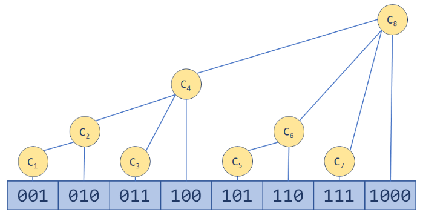

脑子不灵光，再次复习一下

时间复杂度 O(log n)  

相比于前缀和，它可以比前缀和更快的修改数组中的某一个数  

如果前缀和需要更新一个数，那么在它之后的所有数都需要更新，很显然需要非常多的时间

如果只有查询操作，那么肯定是前缀和最好，树状数组和线段树很想，线段树能解决的问题树状数组不一定能解决。也就是说如果一个问题树状数组能解决的话，则不会使用难度稍大的线段树  



x的二进制表示时，其后位有几个0，那么它就是第几层  

设树状数组`tree[]`   

```c++
int lowbit(int x){
    return x & -x;
}
```

那么`tree[x]`就是原数组`(x - lowbit(x), x]`的和  

**向树状数组中的某个位置添加一个数**，相比于前缀和，使用树状数组的原因

x是原数组的位置， v是需要添加的数
```c++
void add(int x, int v){
    for(int i = x; i <= n; i += lowbit(i)) 
        tree[i] += v;
}
```

**通过树状数组求原数组1-x的和**，这里就是替代了前缀和的功能
```c++
int query(int x){
    int res = 0;
    for(int i = x; i > 0; i -= lowbit(i)) res += tree[i];
    return res;
}
```
如果想求`[x,y]`区间的和，只需要`query(y) - query(x - 1)`即可

### **下面是一个简单的例题:**  

### **动态求连续区间和**   

给定 n 个数组成的一个数列，规定有两种操作，一是修改某个元素，二是求子数列 [a,b] 的连续和。

### **输入格式**  

第一行包含两个整数 n 和 m，分别表示数的个数和操作次数。

第二行包含 n 个整数，表示完整数列。

接下来 m 行，每行包含三个整数 k,a,b （k=0，表示求子数列[a,b]的和；k=1，表示第 a 个数加 b）。

数列从 1 开始计数。

### **输出格式**  

输出若干行数字，表示 k=0 时，对应的子数列 [a,b] 的连续和。

### **数据范围**  
```
1 ≤ n ≤ 100000,
1 ≤ m ≤ 100000，
1 ≤ a ≤ b ≤ n
```
### **输入样例：**  
```
10 5
1 2 3 4 5 6 7 8 9 10
1 1 5
0 1 3
0 4 8
1 7 5
0 4 8
```
### **输出样例：**  
```
11
30
35
```

### **代码：**
```c++
#include<cstdio>
#include<cstring>
#include<iostream>
#include<algorithm>

using namespace std;

const int N = 100010;

int a[N], tree[N];
int n, m;

int lowbit(int x){
    return x & -x;
}

void add(int x, int v){
    for(int i = x; i <= n; i += lowbit(i)) tree[i] += v;
}

int query(int x){
    int res = 0;
    for(int i = x; i > 0; i -= lowbit(i)) res += tree[i];
    return res;
}

int main(){
    
    scanf("%d%d", &n, &m);
    for(int i = 1; i <= n; ++ i) scanf("%d", &a[i]);  // 输入到原数组中
	for(int i = 1; i <= n; ++ i) add(i,a[i]);  // 生成树状数组
    for(int i = 1; i <= m; ++ i){
        int k, x, y;
        scanf("%d%d%d", &k, &x, &y);
        if(k) add(x,y);  // k=1，表示第 a 个数加 b
        else printf("%d\n", (query(y) - query(x - 1)));  // k=0，表示求子数列[x,y]的和
    }

    return 0;
}
```