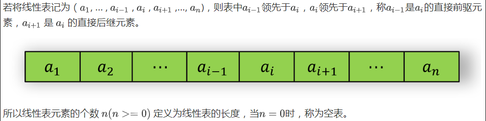

### 线性表的定义

> 由零个或多个数据元素组成的有序序列

首先它是一个序列，也就是说数据元素之间有先来后到之分

若元素存在多个，则第一个元素无前驱，最后一个元素无后继位于某元素之前统称为“前驱元素”，位于此元素之后的统称为“后继元素”。若相邻的元素，如即为“直接前驱”。

线性表处理的元素都是有限的



> 公司的组织架构属于树状结构

> 班级的点名册是线性表

### 线性表的分类

线性表：
    顺序储存结构：
        数组
    链式储存结构：
        单链表
        静态链表
        循环链表
        双向链表


### 抽象数据类型

> 抽象：是指取出事物具有的普遍的本质，是对具体事物的一个概括

> 数据类型：是指一组性质相同的值的集合及定义在此集合上的一些操作的总称

抽象数据类型(Abstract Data Type / ADT)是指一个数据模型及定义在该模型上的一组操作，可以类比成面向对象中的类

例如线性表的抽象数据类型：
```c++
ADT List
Data
    // 创建并返回一个空列表
    List createNullList();
    // 在List中的位置p前插入一个元素x，并返回成功与否的标志
    int insertPre(List list, Position p, DataType x);
    // 在List中的位置p后插入一个元素x，并返回成功与否的标志
    int insertPost(List list, Position p, DataType, x);
    // 在List删除一个值为x的元素，并返回成功与否的标志
    int deleteValue(List list, DataType x);
    // 删除位于p的元素，并返回成功与否的标志
    int deletePostion(List list, Position p);
    // 在List中查找值为x元素的位置
    Postiton locate(List list, DataType x);
    // 判断List是否为空线性表
    int isNull(List list);
end ADT List
```

### 顺序存储结构

> 将线性表中的元素一个接一个地储存在一片相邻的储存结构中

物理上的存储方式事实上就是在内存中找个初始地址，然后通过占位的形式，把一定的内存空间给占了，然后把相同数据类型的数据元素依次放在这块空地中。

> 如果每个元素占用 $c$ 个存储单元，则下标 $i$ 的元素的存储位置于下标为 $i - 1$ 的元素的存储位置之间的关系是 $lco(k_1i) = loc(k_{i-1}) + c$ 

> 当 $i = 0$ 时，其存储位置 $loc(k_0)$ 称为线性表的首地址

> 通过公式，可以在时间复杂度为O(1)内找到线性表中任意位置的元素

代码：
```c++
struct SeqList{
    int MAXNUM;         // 顺序表中最大元素个数
    int n;              // 元素个数
    DataType * element; // 存放线性表中的元素
};
```

### 创建空顺序表

```c++
PSeqList createNullSeqList(int m) {
    PSeqList list = (PSeqList)malloc(sizeof(struct SeqList);
    // 给list分配结构体空间
    if (list != NULL) {
        list->element = (DataType*)malloc(sizeof(DataType) * m);
        // 依据传进来的m来分配数据元素的存储空降
        if (list->element) {
            // 初始化表信息：最大数据元素数量MAXNUM，当前元素个数n
            list->MAXNUM = m;
            list->n = 0;
            return list;
        } else {
            free(list);
        }
    }
    printf("Out of space!!\n");;
    return NULL;
}
```
### 判断线性表是否为空

```c++
int isNullSeqList(PSeqList list) { 
    return list->n == 0; 
}
```

### 在顺序表中求某元素x的下标

```c++
int locateSeq(PSeqList list, DataType x) {
    for (int position = 0; position < list->n; ++ position) {
        if (list->element[positon] == x) return position;
    }
    return -1;
}
```

### 向顺序表中下标为position的元素之前插入元素x

```c++
int insertPreSeq(PSeqList list, int position, DataType x) {
    // 越界
    if (position >= list->n || position < 0) {
        printf("Not exist!\n");
        return 0;
    }
    // 溢出
    if (list->n >= list->MAXNUM) {
        printf("Overflow!\n");
        return 0;
    }
    // 将该位置及该位置之后的所有元素后移一个位置
    for (int i = list->n; i >= position; i--) {
        list->element[i + 1] = list->element[i];
    }
    // 插入该元素x
    list->element[position] = x;
    list->n++;
    return 1;
}
```

### 向顺序表中下标为position的元素之之后插入元素x

```c++
int insertPostSeq(PSeqList list, int position, DataType x) {
    // 越界
    if (position >= list->n || position < 0) {
        printf("Not exist!\n");
        return 0;
    }
    // 溢出
    if (list->n >= list->MAXNUM) {
        printf("Overflow!\n");
        return 0;
    }
    // 将该位置之后（不包括该位置）的所有元素后移一个位置
    for (int i = list->n; i > position; i--) {
        list->element[i + 1] = list->element[i];
    }
    // 插入该元素x
    list->element[position + 1] = x;
    list->n++;
    return 1;
}
```

### 顺序表中删除下标为p的元素

```c++
int deletePostionSeq(PSeqList list, int position){
    // 越界
    if (position > n - 1 || position < 0) {
        printf("Not exist!\n");
        return 0;
    }
    // 被删除元素之后的所有元素前移一个位置
    for (int i = position; i < list->n - 1; ++ i) {
        list->element[i] = list->element[i + 1];
    }
    // 元素个数-1
    list->n --;
    return 1;
}
```
### 顺序表溢出之后进行的操作

> 可以开辟一个更大的空间，将整个数组拷贝过去，例如先开它个两倍

```c++
PSeqList createDoubleSize(PSeqList list){
    // 开辟两倍的空间
    DataType* doubleElement = (DataType*)malloc(sizeof(DataType) * list->MAXNUM * 2);
    // 复制过去
    for (int i = 0; i < list-> MAXNUM; ++ i) {
        doubleElement[i] = list->element[i];
    }
    // 释放之前的内存
    free(list->element);
    // 修改顺序表的信息
    list->element = doubleElement;
    list->MAXNUM *= 2;
}
```

> ~~瞎说了那么多，其实就是一个结构体存放了一个动态数组及其它的信息，然后进行增删查改的过程~~